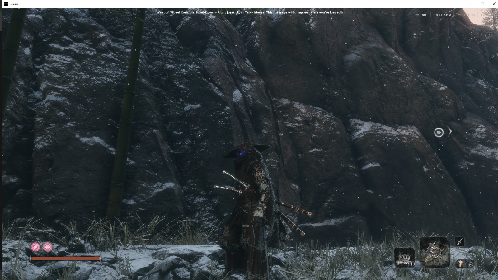

# sekiro-sheath-mode
this mod allows you to change the render status of your katana in sekiro in a ghetto way

press dpad down to toggle the flag

its developed just for fun and experiment

only through pure reversing of sekiro binary

uses minhook and libmem to sigscan and hook (I know I could have just used libmem, dont question it)

##Usage

put the DLL(s) into the Sekiro game folder (where `sekiro.exe` is).
start the game normally

- If you use ModEngine's dinput8 proxy, enable DLL chaining.
- Set `chainDInput8DLLPath` in `modengine.ini` to your DLL path (SheathMode.dll).

open an issue if you have any questions or recommends

and yes it doesnt include the sheath animations, your blade just teleports to your sheath or hand

